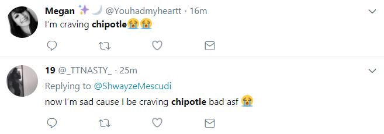

```{r setup, include=FALSE}
knitr::opts_chunk$set(echo = TRUE)
#knitr::opts_knit$get("root.dir")
```


```{r, echo=FALSE}

```

For my final project, I decided to perform Twitter research on Chipotle, the restaurant chain. My reason for choosing Chipotle is that people tend to enjoy tweeting about food. Additionally, the official Chipotle Twitter account, @ChipotleTweets, is a relatively active account with nearly 900,000 followers and 675,000 tweets. I was also curious to see if I could find any relevant information regarding the recent launch of Chipotle's own queso that was released on September 12th of this year. I had seen online after the release that people were generally not happy with the queso and I wanted to see if that could be concluded from the tweets about the queso as well. 

First, I thought it might be interesting from a marketing standpoint to see where people who tweet about Chipotle are located in the United States. There is a feature on Twitter that allows its users to share their location for each specific tweet. I decided to use this information to plot these locations. It should be noted that most people do not have this location feature made visible, so there is not an enormous amount of available location data. Regardless, I thought it might be interesting to see if any particular trends could be visualized.

 
```{r tweets, echo=FALSE, message=FALSE, warning=FALSE, include=FALSE}
# set up Twitter

library(devtools)
library(twitteR)

api_key <- 	"KX9Sk6lCenrrn2yHCe2XKIVKi"
api_secret <- "TNbtVYjfzEfhWKKeKCG4MWbnzLapTyrCP5JhKx5pelVWvbwBO4"
access_token <- "927639225461366785-ct1z0xLv20fctGskDaVUwdBncX3udNw"
access_token_secret <- "l4C0SHwagaACa21SfejxSW79s1fg22Wm3vUamaJrh7Lkl"


setup_twitter_oauth(api_key, api_secret, access_token, access_token_secret)

# [1] "Using direct authentication"
# Use a local file ('.httr-oauth'), to cache OAuth access credentials between R sessions?
# 
# 1: Yes
# 2: No
# 
# Selection: 1
# Adding .httr-oauth to .gitignore


# getting tweets that include the word "chipotle" from the beginning of the year and on
tweets <- searchTwitter("chipotle", n=7000, lang="en", since="2017-01-01")
# Transform tweets list into a data frame
tweets.df <- twListToDF(tweets)

# This queso Twitter search will be performed below in the sentiment chunk
#tweets.chipotle <- searchTwitter("chipotle", n=7000, lang="en", since="2017-09-12")
#tweets.chipotle <- twListToDF(tweets.chipotle)
#tweets.queso <- tweets.chipotle[grep("queso", tweets.chipotle$text),]

```


## Where People are Tweeting about Chipotle in the USA
```{r map, echo=FALSE, message=FALSE, warning=FALSE}

# This reads a csv with tweets information and pulls the USA locations in terms of longitudes and latitudes to then plot the tweets on a map to create map plotting tweets about chipotle in the usa. The longitudes/latitudes are subset to within uSA. To obtain the tweets, the below lines were run to collect 11,000 from over 5 years then converted it to a data frame and saved that as a csv file, which is the file being read. 

# yo <- searchTwitteR("chipotle", n = 11000, since = "2012-01-01")
# yodf <- twListToDF(yo)
# loc <- -1*is.na(yodf$longitude) + 1
# sum(loc)
# loc1  <- which(loc==1)
# locations <- data.frame(latitude = as.numeric(yodf$latitude[loc1]), longitude = as.numeric(yodf$longitude[loc1]))
# locations <- subset(locations, (latitude>=25 & latitude<=50) & (longitude>=-125 & longitude<=-65))

library(ggplot2)
library(ggmap)
library(maps)
library(mapdata)

yodf.read <- read.csv(file="yodf.csv", header=TRUE)
loc.csv <- -1*is.na(yodf.read$longitude) + 1
loc1.csv  <- which(loc.csv==1)
locations.csv <- data.frame(latitude = as.numeric(yodf.read$latitude[loc1.csv]), longitude = as.numeric(yodf.read$longitude[loc1.csv]))
locations.csv <- subset(locations.csv, (latitude>=25 & latitude<=50) & (longitude>=-125 & longitude<=-65))
usa <- map_data("usa")
gg1 <- ggplot() + 
  geom_polygon(data = usa, aes(x=long, y = lat, group = group), fill = "#c9c9ff", color = "#ffb732") + 
  coord_fixed(1.3)
gg1 + geom_point(data = locations.csv, aes(x = longitude, y = latitude), color = "#35a79c", size =2) + labs(x="Longitude", y="Latitude") + ggtitle("Tweet Locations")


```


Unfortunately, as mentioned prior, it can be quite difficult to gather a plethora of locations from tweets just because not many people choose to share their location; however, I was able to gather about 40 locations within the United States from 11,000 tweets and plotted the longitudes and latitudes. Although the locations are a small data set, there still appears to be some clustering going on that can still be useful information. In particular, the West and Midwest regions of the country are extremely lacking in data points. There could be several reasons for this result. Perhaps Chipotle is less popular in these regions, or there may just be less Chipotle restaurant locations in these areas. I found a map online that displays Chipotle restaurant locations on a map of the USA (based on the data from "https://www.redliondata.com/chipotle-stores-map/"). Interestingly enough, this map I inserted below bears a similar resemblance to the map above generated by the tweets, supporting the argument that people are tweeting about Chipotle less in the West and Midwest regions of the United States because there are simply less Chipotle restaurants. The Chipotle marketing team should therefore think about focusing on the areas in which there are a high number of Chipotles, which is mainly the Southern and Northeast parts of the country. However, it may also be of value for the marketing team to focus efforts on the West and extreme Northwest parts of the United States due to the fact that there are quite a few Chipotle restuarant locations there, but they are lacking the Twitter traffic that could be helping their branding in that region. Perhaps the official Chipotle Twitter account could try to interact with users in those areas more than it currently is.


## Word Cloud

Below is a link to a Shiny app I have created which is an interactive word cloud that can alternate between representing words in tweets about Chipotle and, more specifically, tweets about Chipotle's queso. You can use the drop down to select the tweets you wish to have the word cloud express and press the interactive "Change" button to watch the cloud change according to your choice. Then, you can move the sliders to modify the cloud based on the minimum frequency of the words and the maximum number of words. The bigger and bolder a word is within the word cloud, the more frequently it is used in the tweets. After looking at the word cloud at the link below, one can gather some information about how people tend to tweet about Chipotle. 

https://jahorn.shinyapps.io/chipotle-wordcloud/

First, when looking at the Chipotle tweets word cloud when it is set to minimum frequency 10 and maximum number of words 85, significant words that stand out are "Chipotle", "ceo", "founder", "steve", "ells"", "support", "changed", "struggling", "fundraiser", and "turnaround". These words show that many people are tweeting about the issues that the CEO of Chipotle, Steve Ells, is facing. He has been trying to save Chipotle from the many mishaps of E. coli and poorly received queso release. There has also been talk of him stepping down as CEO. (To learn more about the outbreaks of E. coli and other illnesses caused by Chipotle, the FDA discusses them in detail here https://www.fda.gov/Food/RecallsOutbreaksEmergencies/Outbreaks/ucm470410.htm .) However, there are some words like "fundraiser" and "support" that are likely to be from more positive tweets about Chipotle, since Chipotle often helps organizations hold fundraisers at their restaurants. Also, "turnaround" could be indicative of people tweeting about how Chipotle is making a positive turnaround from its near-disastrous illness outbreaks. 

Next, let us look at the Chipotle queso tweets word cloud. I selected tweets for this word cloud that were after September 12th, 2017 to ensure that I collected people's tweets that were posted after the queso was released. For a good visual, set the minimum frequency to 20 and the maximum number of words to 75. Significant words that stand out with this word cloud are "good", "sh*t", "garbage", "super", "bad", and "norovirus". "Norovirus" refers to the outbreak of the norovirus around the Boston College area from Chipotle food in December of 2015. Unfortunately, there seem to be many negative words in the cloud referring to Chipotle's new queso. The spike in the word "norovirus" could be because people fear that with a new food item being introduced to the Chipotle restaurants comes along a new concern that this item may not be safely stored or not adequately prepared to prevent foodborn illnesses. 


## Emoji Analysis

Next, we will look at the emojis that frequently appear in tweets about Chipotle. 
```{r emoji analysis, echo=FALSE, message=FALSE, warning=FALSE, include=FALSE}
# The tweets being used are tweets including 'chipotle', as seen in line 141
# I used the code that Anahita presented in class to create an interesting emoji analysis bar chart
# The ESSENTIAL part to remember when running these emoji analysis chunks is that you set your working directory to be what is necessary to access the necessary files mentioned in the work directories that I have set. These setwd lines can be found on lines 147, 162, and 217.

#set up Twitter Authentication
library(twitteR)
library(reshape)

###### GRAB TWEETS, PROCESS, AND WRITE TO DISK ######
# authenticate with twitter: get your credentials by creating an app at apps.twitter.com
# api_key <- 'KX9Sk6lCenrrn2yHCe2XKIVKi'
# api_secret <- 'TNbtVYjfzEfhWKKeKCG4MWbnzLapTyrCP5JhKx5pelVWvbwBO4'
# access_token <- '927639225461366785-ct1z0xLv20fctGskDaVUwdBncX3udNw'
# access_token_secret <- 'l4C0SHwagaACa21SfejxSW79s1fg22Wm3vUamaJrh7Lkl'
# setup_twitter_oauth(api_key, api_secret, access_token, access_token_secret)

# 2017.0202, #nobannowall
set.seed(20170202); ht <- 'chipotle';
tweets.raw <- searchTwitter(ht, n = 5000, lang = 'en');
df <- twListToDF(strip_retweets(tweets.raw, strip_manual = TRUE, strip_mt = TRUE)); df$hashtag <- ht; df$created <- as.POSIXlt(df$created); df$text <- iconv(df$text, 'latin1', 'ASCII', 'byte'); df$url <- paste0('https://twitter.com/', df$screenName, '/status/', df$id); df <- rename(df, c(retweetCount = 'retweets'));
df.a <- subset(df, select = c(text, created, url, latitude, longitude, retweets, hashtag));
#nrow(df.a); head(df.a);
#setwd("C:/Users/Jacqueline/Downloads/emojis-master/emojis-master/2017.0206 emoji data science tutorial");
setwd("~/finalprojectrepo-master/finalprojectrepo-master");
write.csv(df.a, paste0('tweets.cleaned_', format(min(df.a$created), '%m%d'), '-', format(max(df.a$created), '%m%d'), '_', ht, '_', Sys.Date(), '_', format(Sys.time(), '%H-%M-%S'), '_n', nrow(df.a), '.csv'), row.names = FALSE);
tweets <- df; tweets$z <- 1; tweets$created <- as.POSIXlt(tweets$created); #nrow(tweets); min(tweets$created); max(tweets$created); median(tweets$created);


library(plyr)
library(ggplot2)
library(splitstackshape)
library(stringr)

####### READ IN SAVED TWITTER DATA
# change in fnames 'tutorial_tweets_raw' to
#setwd("C:/Users/Jacqueline/Downloads/emojis-master/emojis-master/2017.0206 emoji data science tutorial")
setwd("~/finalprojectrepo-master/finalprojectrepo-master")
fnames <- c(
  'chipotle'
);
fnames <- paste0(fnames, '.csv'); df <- do.call(rbind.fill, lapply(fnames, read.csv));
df$username <- substr(substr(df$url, 21, nchar(as.character(df$url))), 1, nchar(substr(df$url, 21, nchar(as.character(df$url))))-26);
tweets.full <- df; tweets.full$X <- NULL; tweets.full$z <- 1;
#### sanity checking
tweets.full$created <- as.POSIXlt(tweets.full$created); #min(tweets.full$created); max(tweets.full$created); median(tweets.full$created); nrow(tweets.full); length(unique(tweets.full$username))
## dedupe dataset by url
tweets.dupes <- tweets.full[duplicated(tweets.full$url), ]; #nrow(tweets.full); nrow(tweets.dupes); # test <- subset(tweets.full, url %in% tweets.dupes$url); test <- test[with(test, order(url)), ];
tweets <- tweets.full[!duplicated(tweets.full$url), ]; tweets <- arrange(tweets, url); row.names(tweets) <- NULL; tweets$tweetid <- as.numeric(row.names(tweets)); #nrow(tweets);
tweets.final <- tweets;
## dedupe dataset by username
tweets.dupes <- tweets.full[duplicated(tweets.full$username), ]; #nrow(tweets.full); nrow(tweets.dupes); # test <- subset(tweets, url %in% tweets.dupes$url); test <- test[with(test, order(url)), ];
tweets <- tweets.full[!duplicated(tweets.full$username), ]; tweets <- arrange(tweets, url); row.names(tweets) <- NULL; tweets$tweetid <- as.numeric(row.names(tweets)); #nrow(tweets);

#### READ IN EMOJI DICTIONARIES
emdict.la <- read.csv('emoticon_conversion_noGraphic.csv', header = F); #Lauren Ancona; https://github.com/laurenancona/twimoji/tree/master/twitterEmojiProject
emdict.la <- emdict.la[-1, ]; row.names(emdict.la) <- NULL; names(emdict.la) <- c('unicode', 'bytes', 'name'); emdict.la$emojiid <- row.names(emdict.la);
emdict.jpb <- read.csv('emDict.csv', header = F) #Jessica Peterka-Bonetta; http://opiateforthemass.es/articles/emoticons-in-R/
emdict.jpb <- emdict.jpb[-1, ]; row.names(emdict.jpb) <- NULL; names(emdict.jpb) <- c('name', 'bytes', 'rencoding'); emdict.jpb$name <- tolower(emdict.jpb$name);
emdict.jpb$bytes <- NULL;
## merge dictionaries
emojis <- merge(emdict.la, emdict.jpb, by = 'name');  emojis$emojiid <- as.numeric(emojis$emojiid); emojis <- arrange(emojis, emojiid);

###### FIND TOP EMOJIS FOR A GIVEN SUBSET OF THE DATA
tweets <- tweets.final;
# tweets <- subset(tweets.final, hashtag %in% c('#womensmarch'));
## create full tweets by emojis matrix
df.s <- matrix(NA, nrow = nrow(tweets), ncol = ncol(emojis));
systemtime <- system.time(df.s <- sapply(emojis$rencoding, regexpr, tweets$text, ignore.case = T, useBytes = T));
rownames(df.s) <- 1:nrow(df.s); colnames(df.s) <- 1:ncol(df.s); df.t <- data.frame(df.s); df.t$tweetid <- tweets$tweetid;
# merge in hashtag data from original tweets dataset
df.a <- subset(tweets, select = c(tweetid, hashtag));
df.u <- merge(df.t, df.a, by = 'tweetid'); df.u$z <- 1; df.u <- arrange(df.u, tweetid);
tweets.emojis.matrix <- df.u;
## create emoji count dataset
df <- subset(tweets.emojis.matrix)[, c(2:843)]; count <- colSums(df > -1);
emojis.m <- cbind(count, emojis); emojis.m <- arrange(emojis.m, desc(count));
emojis.count <- subset(emojis.m, count > 1); emojis.count$dens <- round(1000 * (emojis.count$count / nrow(tweets)), 1); emojis.count$dens.sm <- (emojis.count$count + 1) / (nrow(tweets) + 1);
emojis.count$rank <- as.numeric(row.names(emojis.count));
emojis.count.p <- subset(emojis.count, select = c(name, dens, count, rank));
# print summary stats
#subset(emojis.count.p, rank <= 10);
num.tweets <- nrow(tweets); df.t <- rowSums(tweets.emojis.matrix[, c(2:843)] > -1); num.tweets.with.emojis <- length(df.t[df.t > 0]); num.emojis <- sum(emojis.count$count);
#min(tweets$created); max(tweets$created); median(tweets$created);
#num.tweets; num.tweets.with.emojis; round(100 * (num.tweets.with.emojis / num.tweets), 1); num.emojis; nrow(emojis.count);
```

```{r emoji analysis chart, echo=FALSE, message=FALSE, warning=FALSE}
##### MAKE BAR CHART OF TOP EMOJIS IN NEW DATASET, emoji analysis
df.plot <- subset(emojis.count.p, rank <= 10); xlab <- 'Rank'; ylab <- 'Overall Frequency (per 5,000 Tweets)';
#opts_knit$set(root.dir = "C:/Users/Jacqueline/Downloads/emojis-master/ios_9_3_emoji_files")
#setwd("C:/Users/Jacqueline/Downloads/emojis-master/ios_9_3_emoji_files")
setwd("~/finalprojectrepo-master/finalprojectrepo-master/ios_9_3_emoji_files/ios_9_3_emoji_files")
df.plot <- arrange(df.plot, name);
# error in imgs
imgs <- lapply(paste0(df.plot$name, '.png'), png::readPNG); g <- lapply(imgs, grid::rasterGrob);
k <- 0.20 * (10/nrow(df.plot)) * max(df.plot$dens); df.plot$xsize <- k; df.plot$ysize <- k; #df.plot$xsize <- k * (df.plot$dens / max(df.plot$dens)); df.plot$ysize <- k * (df.plot$dens / max(df.plot$dens));
df.plot <- arrange(df.plot, name);
# error in g1 with g because need imgs for g
##ff7954 peach
g1 <- ggplot(data = df.plot, aes(x = rank, y = dens)) +
  geom_bar(stat = 'identity', fill = '#f4a644') +
  xlab(xlab) + ylab(ylab) +
  mapply(function(x, y, i) {
    annotation_custom(g[[i]], xmin = x-0.5*df.plot$xsize[i], xmax = x+0.5*df.plot$xsize[i],
                      ymin = y-0.5*df.plot$ysize[i], ymax = y+0.5*df.plot$ysize[i])},
    df.plot$rank, df.plot$dens, seq_len(nrow(df.plot))) +
  scale_x_continuous(expand = c(0, 0), breaks = seq(1, nrow(df.plot), 1), labels = seq(1, nrow(df.plot), 1)) +
  scale_y_continuous(expand = c(0, 0), limits = c(0, 1.10 * max(df.plot$dens))) +
  theme(panel.grid.minor.y = element_blank(),
        axis.title.x = element_text(size = 10), axis.title.y = element_text(size = 14),
        axis.text.x  = element_text(size = 8, colour = 'black'), axis.text.y  = element_text(size = 8, colour = 'black')) + ggtitle("Most Common Emojis Tweeted with 'Chipotle'");
g1;
```

This chart above looks at the emojis being used in tweets about Chipotle and ranks the top ten starting from the most used starting at the left. Some of the top emojis can be logically interpreted, such as the heart eyes face, heart, praise hands, and smiling faces. However, the top two emojis can be a little confusing out of context. The top emoji tweeted along with "Chipotle" is the laugh crying face, followed by the crying face. These may seem sad or of mocking nature, but below are some example of tweets with these emojis to get a general idea of what the context of the tweet usually is. 





```{r}
```

These tweets pictured above are good examples of the context of the tweets containing these emojis. One can conclude from the chart and the tweets that most people tweeting about Chipotle and using emojis are tweeting positively about the restaurant chain, often saying they are craving the food.


## Sentiments Expressed in Tweets about Chipotle

Below we will look at the sentiments of tweets about Chipotle, but in relation to Twitter users' word choices. 
 
```{r sentiments, echo=FALSE, message=FALSE, warning=FALSE, include=FALSE}
# This code regarding text sentiment tidies the tweets and unnests them, while also looking out for stop words

library(tidytext)
library(tidyverse)
library(SnowballC)
library(stringr)
library(scales)

custom_stop_words <- bind_rows(data_frame(word = c("dick"), 
                                          lexicon = c("custom")), 
                               stop_words)


tidy_tweets.df <- tweets.df %>% 
  unnest_tokens(word,text)

tidy_tweets.df <-  tidy_tweets.df %>% 
  anti_join(custom_stop_words)


tweets.queso.1 <- searchTwitter("chipotle", n=7000, lang="en", since="2017-09-12")
tweets.queso.1 <- twListToDF(tweets.queso.1)
tweets.queso.1 <- tweets.queso.1[grep("queso", tweets.queso.1$text),]


tidy_tweets.queso <- tweets.queso.1 %>% 
  unnest_tokens(word,text)

tidy_tweets.queso <-  tidy_tweets.queso %>% 
  anti_join(custom_stop_words)
```

```{r chart1, echo=FALSE, message=FALSE, warning=FALSE}
# This chunk regarding sentiment analysis uses the tidytext and tidyverse packages to access sentiment analysis functions and create a chart ranking words' contribution to positive or negative sentiment using get_sentiment("bing")


bing_word_counts <- tidy_tweets.df %>%
  inner_join(get_sentiments("bing")) %>%
  count(word, sentiment, sort = TRUE) %>%
  ungroup()

bing_word_counts %>%
  group_by(sentiment) %>%
  top_n(10) %>%
  ungroup() %>%
  mutate(word = reorder(word, n)) %>%
  ggplot(aes(word, n, fill = sentiment)) +
  geom_col(show.legend = FALSE) +
  scale_fill_manual(values=c("#ffb732", "#c9c9ff")) +
  facet_wrap(~sentiment, scales = "free_y") +
  labs(y = "Contribution to Sentiment",
       x = NULL) +
  ggtitle("Negative vs. Positive Words in Tweets about Chipotle") +
  coord_flip()

```


The chart above looks at positive and negative words used in tweets about Chipotle. There are relatively high contributions of positive sentiment words to the tweets versus the lower contributions of the negative words. "Support" is a very popular positive word being tweeted with "Chipotle", with "love" also usually being at the top of the list. Below is a table that includes a sample of 25 tweets that are about Chipotle and include the word "support", to show a glimpse of what these types of tweets look like.

Sample "Support" Tweets:
```{r}
```


```{r tweetgrid, echo=FALSE, message=FALSE, warning=FALSE}
# the word with highest contribution to the positive sentiment is "support"; so now we will look at what some of those tweets look like in a table that is collected of tweets that are abput Chipotle and include the word support found with grep funtion and cleaned

tweets.df.support <- tweets.df[grep("support", tweets.df$text),]
library(gridExtra)

clean_tweet.support = gsub("&amp", "", tweets.df.support$text)
clean_tweet.support = gsub("(RT|via)((?:\\b\\W*@\\w+)+)", "", clean_tweet.support)
clean_tweet.support = gsub("@\\w+", "", clean_tweet.support)
clean_tweet.support = gsub("[[:punct:]]", "", clean_tweet.support)
clean_tweet.support = gsub("[[:digit:]]", "", clean_tweet.support)
clean_tweet.support = gsub("http\\w+", "", clean_tweet.support)
clean_tweet.support = gsub("[ \t]{2,}", "", clean_tweet.support)
clean_tweet.support = gsub("^\\s+|\\s+$", "", clean_tweet.support)
clean_tweet.support <- str_replace_all(clean_tweet.support," "," ")
clean_tweet.support <- str_replace(clean_tweet.support,"RT @[a-z,A-Z]*: ","")
clean_tweet.support <- str_replace_all(clean_tweet.support,"#[a-z,A-Z]*","")
clean_tweet.support <- str_replace_all(clean_tweet.support,"@[a-z,A-Z]*","")  
clean_tweet.support <- gsub("@\\w+ *", "", clean_tweet.support)
clean_tweet.support <- gsub("#\\w+ *", "", clean_tweet.support)
clean_tweet.support <- gsub("\n", " ", clean_tweet.support)
clean_tweet.support <- gsub("[^a-zA-Z #]","",clean_tweet.support)    # "a-zA-Z #" are the things we need
clean_tweet.support <- gsub("https\\w+ *", "", clean_tweet.support)
clean_tweet.support <- tolower(clean_tweet.support)

tweets.support.ex <- clean_tweet.support[1:25]
grid.table(tweets.support.ex)

```


If you take a look above at the group of tweets I pulled about Chipotle, it seems to be that a many of these tweets that include "support", which is a large proportion of positive tweets about Chipotle, are about different fundraisers that are being held at Chipotle and the tweets are mostly inviting people to come and "support" by coming to the participating Chipotle. This is much more reassuring about the reputation of Chipotle, being that the word clouds were slightly more negative. This chart may represent that there is still a lot of positivity surrounding the company, despite its various scandals and obstacles it has encountered in the recent years. Since these tweets are from the beginning of this current year on, we know we are getting tweets that have occured after most of the major negative publicity instances of Chipotle, showing that despite the issues Chipotle has had, many people still take on the opportunity to fundraise with the company and do good, which is beneficial to Chipotle's reputation as well.


```{r second sentiment chart, echo=FALSE, message=FALSE, warning=FALSE}
# In this chunk is the same type of code for the first sentiment chart but not looking at tweets that include "chipotle" and "queso"

#If you take a look at the group of tweets I pulled about Chipotle, it seems to be that a grand majority of these tweets that include "support", which is a large proportion of positive tweets about Chipotle, are about different fundraisers that are being held at Chipotle and the tweets are mostly inviting people to come and "support" by coming to the participating Chipotle. This is much more reassuring about the reputation of Chipotle, being that the word clouds were slightly more negative. This chart may represent that there is still a lot of positivity surrounding the company, despite its various scandals and obstacles it has encountered in the recent years. Since these tweets are from the beginning of this current year on, we know we are getting tweets that have occured after most of the major negative publicity instances of Chipotle, showing that despite the issues Chipotle has had, many people still take on the opportunity to fundraise with the company and do good, which is beneficial to Chipotle's reputation as well.


bing_word_counts.1 <- tidy_tweets.queso %>%
  inner_join(get_sentiments("bing")) %>%
  count(word, sentiment, sort = TRUE) %>%
  ungroup()

bing_word_counts.1 %>%
  group_by(sentiment) %>%
  top_n(10) %>%
  ungroup() %>%
  mutate(word = reorder(word, n)) %>%
  ggplot(aes(word, n, fill = sentiment)) +
  geom_col(show.legend = FALSE) +
  scale_fill_manual(values=c("#ffb732", "#c9c9ff")) +
  facet_wrap(~sentiment, scales = "free_y") +
  labs(y = "Contribution to Sentiment",
       x = NULL) +
  ggtitle("Negative vs. Positive Words in Tweets about Chipotle's Queso") +
  coord_flip()


```


Looking at the second set of charts regarding sentiment, which looks more specifically at sentiment regarding Chipotle's queso, there are sadly not many positive words being used in tweets regarding the new queso. On the other hand, there are many more negative words being used and at a higher frequency. For example, "garbage" or "trash" tend to usually be at the top of the negative side, which does not mean good news for Chipotle. The queso was supposed to be a new marketing technique to help get customers back that may have made the decision to frequent the restaurant chain less often perhaps due to the E. coli and norovirus breakouts that occurred in 2015 and 2016. 

## Final Thoughts

Based on all of the analysis above, Chipotle's bid to get back its diners with queso does not appear to have been received well based on the tweet text analysis that has been performed. Both the word cloud and text sentiment analysis showed much negativity surrounding the queso. However, Chipotle should not lose hope because as shown in the first sentiment chart, there is still a fair amount of positivity surrounding the company, primarily with fundraising. The emoji analysis chart also shows relatively positive results. But perhaps Chipotle should focus its efforts on continuing to enhance its humanitarian image in conjunction with promoting their efforts to ensure safe food preparation, rather than trying to promote its new queso. Additionally, Chipotle may want to increase their Twitter interaction in areas of the United States where there are Chipotle restaurants but a lack of tweets about Chipotle. Twitter could be a very valuable tool to the Chipotle brand to research its consumer base and help the company make smart business decisions.


